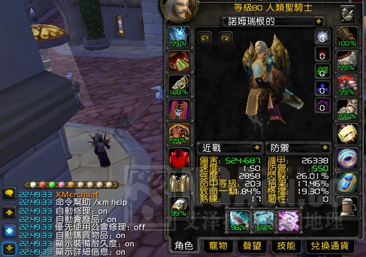

# xmerchant-wow

当年的 wow 插件

xmerchant 1.0 購買材料/自動販賣垃圾/修裝備/顯示裝備耐久

名稱: xmerchant

版本號: 1.0

更新日期: 2009-09-23

支持语言：zhCN/zhTW

WOW版本： 3.2

作者： xnotepad

版權： <http://creativecommons.org/licenses/by-nc-sa/2.5/cn/>

很久以前的一個練手作品，後來有merchantex之後，就一直在用merchantex，最近玩台服，發現merchantex沒更新了，於是就把這個東西改了下，添加了個設置的命令行界面。操作和功能與merchantex基本上一模一樣。多了個顯示裝備耐久的功能。

命令：

修理： /xm r on|off 或者 /xm repair on|off

優先使用公會銀行修理： /xm u on|off 或者 /xm useguildbank on|off

販賣垃圾： /xm s on|off 或者 /xm sell on|off

購買物品： /xm b on|off 或者 /xm buy on|off

設定購買物品：/xm b 物品鏈接 數量

顯示詳細信息： /xm details on|off

顯示裝備耐久： /xm d on|off 或者 /xm durability on|off

## 版权

<https://creativecommons.org/licenses/by-nc-sa/2.5/cn/>
